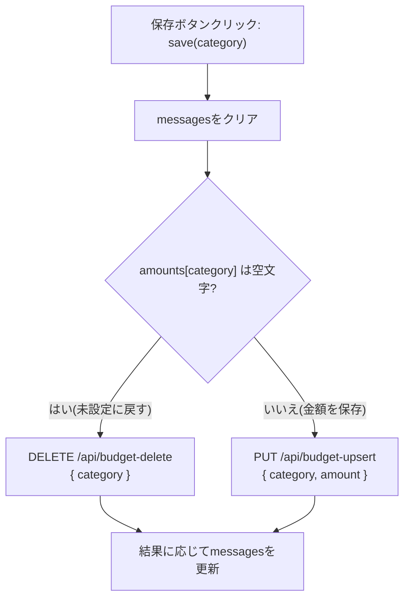

# 設計書: 予算設定(/budget)

全体像・DB設計・共通仕様は [overview.md](./overview.md) を参照。

## 概要

支出カテゴリごとに、継続的な(月替わりしない)月間予算額を設定する画面。ここで設定した値は[list.md](./list.md)の予算消化状況(`BudgetProgress`)で参照される。

対象は支出カテゴリのみ(収入に予算は設定しない)。予算は任意設定で、12個あるカテゴリすべてに強制しない。

関連ファイル: [project/src/app/budget/page.tsx](../../project/src/app/budget/page.tsx)、[project/src/app/api/budget-search/route.ts](../../project/src/app/api/budget-search/route.ts)、[project/src/app/api/budget-upsert/route.ts](../../project/src/app/api/budget-upsert/route.ts)、[project/src/app/api/budget-delete/route.ts](../../project/src/app/api/budget-delete/route.ts)

## 画面構成

支出カテゴリ(`CATEGORIES_BY_TYPE.支出`、12個)を1行ずつ並べたカード。各行は「カテゴリ名 + 金額入力欄(未設定なら空欄) + 保存ボタン」。保存すると、そのカテゴリの行の下にだけ結果メッセージ(「保存しました」など)を表示する。

行ごとに独立して保存できる(フォーム全体の一括送信ではない)。

## 状態管理

| state | 型 | 役割 |
|---|---|---|
| `loading` | `boolean` | 初回取得中の表示切り替え |
| `error` | `string` | 初回取得全体の失敗メッセージ |
| `amounts` | `Record<category, string>` | カテゴリごとの入力欄の文字列(未設定なら空文字) |
| `messages` | `Record<category, string>` | カテゴリごとの保存結果メッセージ |

`amounts`/`messages`は12カテゴリ分をまとめて1つのオブジェクトで持ち、更新はいずれも関数形式(`setAmounts(prev => ({ ...prev, [category]: value }))`)。カテゴリごとに独立した非同期の保存が並行して走りうるため、直前のクロージャ値ではなく常に最新の状態から更新する([Issue #44](https://github.com/mHayashi-1001/kakeibo/issues/44)で修正)。

## 処理フロー: 保存(`save`)

金額欄が空文字かどうかで、呼び出すAPIが分岐する。



## API仕様

### `GET /api/budget-search`
```json
{ "success": true, "budgets": [{ "category": "食費", "amount": 40000 }] }
```
設定済みの予算のみ返る(未設定のカテゴリは含まれない)。

### `PUT /api/budget-upsert`
リクエスト: `{ "category": "食費", "amount": "40000" }`
バリデーション(`validateBudget`): `category`が支出カテゴリの候補に含まれること、`amount`が0以上の数値であること。
DB操作: `INSERT INTO budget (category, amount) VALUES (...) ON CONFLICT (category) DO UPDATE SET amount = ...`(既にあれば上書き、なければ新規作成)

### `DELETE /api/budget-delete`
リクエスト: `{ "category": "食費" }`
DB操作: `DELETE FROM budget WHERE category = ...`。対象行が元々0件でも(=既に未設定でも)エラーにはしない(結果的に「未設定」という状態は変わらないため)。

## list画面との連携

[list.md](./list.md)の予算消化状況は、`/list`画面が独自に`GET /api/budget-search`を呼んで取得する(`/budget`画面とは別のfetch)。`/budget`で保存した内容を`/list`側へリアルタイムに伝える仕組みはなく、`/list`を再読み込みすれば最新の予算が反映される。
