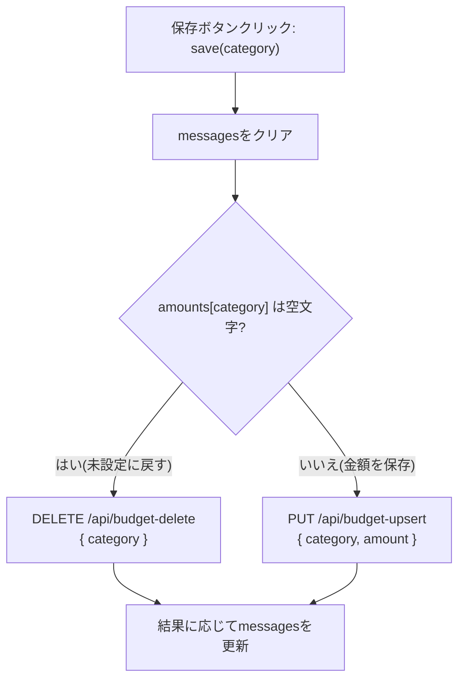

# 設計書: 予算設定(/budget)

全体像・DB設計・共通仕様は [overview.md](./overview.md) を参照。

## 概要

支出カテゴリごとに、継続的な(月替わりしない)月間予算額を設定する画面。ここで設定した値は[list.md](./list.md)の予算消化状況(`BudgetProgress`)で参照される。

対象は支出カテゴリのみ(収入に予算は設定しない)。予算は任意設定で、12個あるカテゴリすべてに強制しない。

関連ファイル:
- フロントエンド: [project/src/app/budget/page.tsx](../../project/src/app/budget/page.tsx)
- バックエンド: [project/src/app/api/budget-search/route.ts](../../project/src/app/api/budget-search/route.ts)、[project/src/app/api/budget-upsert/route.ts](../../project/src/app/api/budget-upsert/route.ts)、[project/src/app/api/budget-delete/route.ts](../../project/src/app/api/budget-delete/route.ts)

## 画面構成

支出カテゴリ(`CATEGORIES_BY_TYPE.支出`、12個)を1行ずつ並べたカード。各行は「カテゴリ名 + 金額入力欄(未設定なら空欄) + 保存ボタン」。保存すると、そのカテゴリの行の下にだけ結果メッセージ(「保存しました」など)を表示する。

行ごとに独立して保存できる(フォーム全体の一括送信ではない)。

## 画面レイアウト

HTMLモック: [mockups/budget.html](./mockups/budget.html)(ブラウザで直接開いて見た目を確認できる。実際の保存・API通信はしない静的モック)

説明文の下に、支出カテゴリ12個分の行(カテゴリ名 + 金額入力欄 + 保存ボタン)が並ぶ。未設定のカテゴリは入力欄がplaceholder「未設定」の空欄になる。保存すると、その行の下にだけ結果メッセージが表示される。

## 項目定義

| No | 項目名 | state キー | 型/属性 | 桁数 | 必須 | 初期値 |
|---|---|---|---|---|---|---|
| 1 | カテゴリ(表示のみ) | `EXPENSE_CATEGORIES`(`CATEGORIES_BY_TYPE.支出`) | 文字列(列挙、固定12種) | 2〜4文字 | — | — (編集不可、行の見出し) |
| 2 | 予算額 | `amounts[category]` / `budget.amount` | 文字列→整数(`INTEGER`) | 上限なし(DB上は32bit整数) | - (空欄可。空欄=未設定) | `""`(未設定時) |

`budget`テーブルの主キーは`category`そのもの(サロゲートIDなし)。1カテゴリにつき最大1行。

## 状態管理

| state | 型 | 役割 |
|---|---|---|
| `loading` | `boolean` | 初回取得中の表示切り替え |
| `error` | `string` | 初回取得全体の失敗メッセージ |
| `amounts` | `Record<category, string>` | カテゴリごとの入力欄の文字列(未設定なら空文字) |
| `messages` | `Record<category, string>` | カテゴリごとの保存結果メッセージ |

`amounts`/`messages`は12カテゴリ分をまとめて1つのオブジェクトで持ち、更新はいずれも関数形式(`setAmounts(prev => ({ ...prev, [category]: value }))`)。カテゴリごとに独立した非同期の保存が並行して走りうるため、直前のクロージャ値ではなく常に最新の状態から更新する([Issue #44](https://github.com/mHayashi-1001/kakeibo/issues/44)で修正)。

## 処理フロー: 保存(`save`)

金額欄が空文字かどうかで、呼び出すAPIが分岐する。



## チェック処理仕様

実装: [project/src/lib/validate.ts](../../project/src/lib/validate.ts) の `validateBudget`(`PUT /api/budget-upsert`でのみ使用)。`DELETE /api/budget-delete`は専用の簡易チェックのみ行う。

### `PUT /api/budget-upsert`

| No | チェック項目 | 内容 | エラーメッセージ |
|---|---|---|---|
| 1 | データ有無 | リクエストボディが存在すること | `データがありません` |
| 2 | カテゴリ整合性 | `category`が`CATEGORIES_BY_TYPE.支出`の候補に含まれること(収入カテゴリは不可) | `categoryが不正です` |
| 3 | 金額形式 | `amount`が空文字/`null`/`undefined`でなく数値に変換できること(`0`は許容) | `amountが不正です` |
| 4 | 金額範囲 | `amount`が0以上であること(負数不可) | `amountが不正です` |

### `DELETE /api/budget-delete`

| No | チェック項目 | 内容 | エラーメッセージ |
|---|---|---|---|
| 1 | カテゴリ整合性 | `category`が存在し、`CATEGORIES_BY_TYPE.支出`の候補に含まれること | `categoryが不正です` |

## DB更新仕様

対象テーブル: `budget`(主キー`category`のみのシンプルなテーブル)

### `PUT /api/budget-upsert` — カラム単位の設定内容

upsert(`category`が既存行にあれば`amount`を上書き、なければ新規1行作成)。

| カラム | 設定するか | 設定値 | 備考 |
|---|---|---|---|
| `category` | する | リクエストの`category` | 主キー。`ON CONFLICT`の判定に使用 |
| `amount` | する | リクエストの`amount` | `Number.parseInt`で整数に変換してから格納。既存行があれば上書き |

| 項目 | 内容 |
|---|---|
| 参考: 実行SQL | `INSERT INTO budget (category, amount) VALUES ($1, $2) ON CONFLICT (category) DO UPDATE SET amount = $2` |
| 実行環境 | Edge Runtime + `neon()`(本番Neon DBのみ) |

### `DELETE /api/budget-delete` — 削除内容

検索条件(WHERE): `category = リクエストのcategory`。更新対象カラムはなし(行そのものを削除)。

| 項目 | 内容 |
|---|---|
| 参考: 実行SQL | `DELETE FROM budget WHERE category = $1` |
| 0件時の扱い | エラーにしない。元々未設定(0件)でも、削除後も「未設定」で状態は変わらないため |
| 実行環境 | Edge Runtime + `neon()`(本番Neon DBのみ) |

### `GET /api/budget-search` — 取得内容

| カラム | SELECTするか |
|---|---|
| `category`, `amount` | する(全カラム) |

| 項目 | 内容 |
|---|---|
| 参考: 実行SQL | `SELECT category, amount FROM budget ORDER BY category` |

## API仕様

### `GET /api/budget-search`
```json
{ "success": true, "budgets": [{ "category": "食費", "amount": 40000 }] }
```
設定済みの予算のみ返る(未設定のカテゴリは含まれない)。

### `PUT /api/budget-upsert`
リクエスト: `{ "category": "食費", "amount": "40000" }`
レスポンス(成功時): `{ "success": true }`

### `DELETE /api/budget-delete`
リクエスト: `{ "category": "食費" }`
レスポンス(成功時): `{ "success": true }`

## list画面との連携

[list.md](./list.md)の予算消化状況は、`/list`画面が独自に`GET /api/budget-search`を呼んで取得する(`/budget`画面とは別のfetch)。`/budget`で保存した内容を`/list`側へリアルタイムに伝える仕組みはなく、`/list`を再読み込みすれば最新の予算が反映される。
