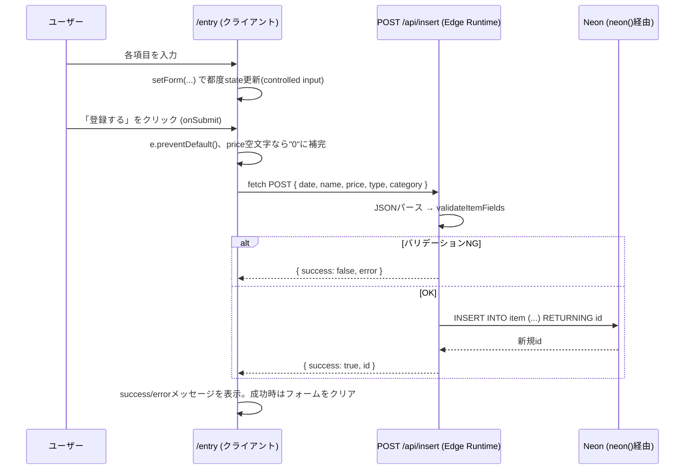

# 設計書: 収支入力(/entry)

全体像・DB設計・共通仕様は [overview.md](./overview.md) を参照。

## 概要

収支(支出または収入)を1件登録するフォーム画面。送信すると`item`テーブルに1行追加される。

関連ファイル: [project/src/app/entry/page.tsx](../../project/src/app/entry/page.tsx)、[project/src/app/api/insert/route.ts](../../project/src/app/api/insert/route.ts)

## 画面構成

カード型の1カラムフォーム。上から順に:

1. **収支種別** — 「支出」「収入」のボタン切り替え(選択中は種別に応じた色で強調表示)
2. **カテゴリ** — セレクトボックス。選択中の収支種別に応じて候補が変わる(`CATEGORIES_BY_TYPE`参照)
3. **日付** — `<input type="date">`
4. **内容** — テキスト入力(品目・メモ)
5. **金額** — 数値入力(`inputMode="numeric"`)
6. **登録するボタン** — 送信。結果に応じて成功/エラーメッセージを表示

## 入力項目とバリデーション

| 項目 | フォームのstateキー | 必須 | バリデーション(`validateItemFields`) |
|---|---|---|---|
| 収支種別 | `type` | ○ | `ITEM_TYPES`(`"支出"`/`"収入"`)のいずれか |
| カテゴリ | `category` | ○ | 選択中`type`に対応する`CATEGORIES_BY_TYPE`の候補に含まれること |
| 日付 | `date` | - | 未入力時はサーバー側で現在時刻を補う |
| 内容 | `name` | ○ | 空文字不可 |
| 金額 | `price` | ○ | 数値に変換できること(0円は許容、空文字/undefined/nullは不可) |

## 状態管理

- `form`(1つのオブジェクトにフォーム全項目をまとめて保持)、`message`(結果メッセージ)、`success`(メッセージの成否)の3つの`useState`
- 収支種別を切り替えると、`category`をその種別の先頭候補にリセットする(支出用と収入用でカテゴリの集合が違うため、無効な組み合わせを防ぐ)
- 送信成功時はフォームを初期状態にクリアする

## 処理フロー



## API仕様: `POST /api/insert`

**リクエスト**
```json
{ "date": "2026-07-01", "name": "スーパーで買い物", "price": "3200", "type": "支出", "category": "食費" }
```

**レスポンス(成功時)**
```json
{ "success": true, "id": 42 }
```

**レスポンス(失敗時、例: カテゴリ不正)**
```json
{ "success": false, "error": "categoryが不正です" }
```

`id`はDB側の`autoincrement`で自動採番されるため、リクエストに含める必要はない(含めても無視される)。
