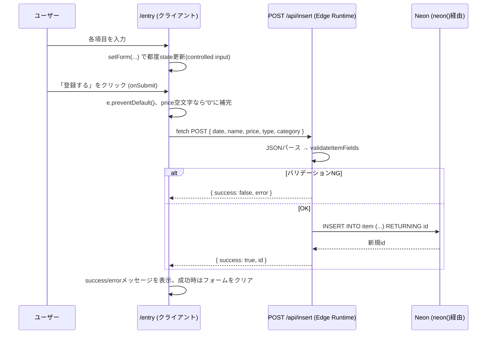

# 設計書: 収支入力(/entry)

全体像・DB設計・共通仕様は [overview.md](./overview.md) を参照。

## 概要

収支(支出または収入)を1件登録するフォーム画面。送信すると`item`テーブルに1行追加される。

関連ファイル:
- フロントエンド: [project/src/app/entry/page.tsx](../../project/src/app/entry/page.tsx)
- バックエンド: [project/src/app/api/insert/route.ts](../../project/src/app/api/insert/route.ts)

## 画面構成

カード型の1カラムフォーム。上から順に:

1. **収支種別** — 「支出」「収入」のボタン切り替え(選択中は種別に応じた色で強調表示)
2. **カテゴリ** — セレクトボックス。選択中の収支種別に応じて候補が変わる(`CATEGORIES_BY_TYPE`参照)
3. **日付** — `<input type="date">`
4. **内容** — テキスト入力(品目・メモ)
5. **金額** — 数値入力(`inputMode="numeric"`)
6. **登録するボタン** — 送信。結果に応じて成功/エラーメッセージを表示

## 画面レイアウト

```
┌─────────────────────────────────┐
│           収支を入力               │  h1 title
├─────────────────────────────────┤
│ 収支種別  [ 支出 ] [ 収入 ]         │  ボタン2択(選択中は色付き)
│                                   │
│ カテゴリ  [ 食費            ▼ ]   │  select(typeに連動)
│                                   │
│ 日付      [ 2026-07-01       ]   │  input type="date"
│                                   │
│ 内容      [ スーパーで買い物   ]   │  input type="text"
│                                   │
│ 金額      [ 3200             ]   │  input inputMode="numeric"
│                                   │
│         [     登録する     ]      │  submit button
│                                   │
│   (送信成功！ / エラー発生: ...)   │  結果メッセージ(送信後のみ表示)
└─────────────────────────────────┘
```

## 項目定義

| No | 項目名 | 画面表示 | state/DBカラム | 型/属性 | 桁数 | 必須 | 初期値 |
|---|---|---|---|---|---|---|---|
| 1 | 収支種別 | 収支種別 | `type` / `item.type` | 文字列(列挙: `"支出"` \| `"収入"`) | 2文字固定 | ○ | `"支出"`(`ITEM_TYPES[0]`) |
| 2 | カテゴリ | カテゴリ | `category` / `item.category` | 文字列(列挙、`type`依存) | 2〜4文字(候補内) | ○ | 選択中`type`の先頭候補 |
| 3 | 日付 | 日付 | `date` / `item.date` | 文字列→DATE(`YYYY-MM-DD`) | 10文字固定 | - | 空文字(未入力時はAPI側で現在時刻を補完) |
| 4 | 内容 | 内容 | `name` / `item.name` | 文字列(自由入力) | 上限なし(DB上は`TEXT`、フロントも未設定) | ○ | `""` |
| 5 | 金額 | 金額 | `price` / `item.price` | 文字列→整数(`INTEGER`) | 上限なし(DB上は32bit整数、実用上は9桁程度まで) | ○ | `""` |

DBの型は`item`テーブルの実際のカラム型([../../project/prisma/migrations/](../../project/prisma/migrations/)参照)。`id`は自動採番のため入力項目には含まない。

## 状態管理

- `form`(1つのオブジェクトにフォーム全項目をまとめて保持)、`message`(結果メッセージ)、`success`(メッセージの成否)の3つの`useState`
- 収支種別を切り替えると、`category`をその種別の先頭候補にリセットする(支出用と収入用でカテゴリの集合が違うため、無効な組み合わせを防ぐ)
- 送信成功時はフォームを初期状態にクリアする

## 処理フロー



## チェック処理仕様

実装: [project/src/lib/validate.ts](../../project/src/lib/validate.ts) の `validateItemFields`。上から順に判定し、最初に該当した1件だけをエラーとして返す(複数エラーの同時表示はしない)。

| No | チェック項目 | 内容 | エラーメッセージ |
|---|---|---|---|
| 1 | データ有無 | リクエストボディが存在すること | `データがありません` |
| 2 | 内容必須 | `name`が空文字でなく文字列であること | `nameが不正です` |
| 3 | 金額形式 | `price`が空文字/`null`/`undefined`でなく、数値に変換できること(`0`は許容) | `priceが不正です` |
| 4 | 収支種別 | `type`が`ITEM_TYPES`(`"支出"`/`"収入"`)のいずれかであること | `typeが不正です` |
| 5 | カテゴリ整合性 | `category`が、選択中`type`に対応する`CATEGORIES_BY_TYPE`の候補に含まれること | `categoryが不正です` |

このチェックはAPIルート側(バックエンド)でのみ実行される。フロントエンドは`<select>`で選択肢を候補内に制限しているため、通常はNo.4/5には抵触しない(直接APIを叩いた場合の防御として機能する)。

## DB更新仕様

| 項目 | 内容 |
|---|---|
| 実行SQL | `INSERT INTO item (date, name, price, category, type) VALUES ($1, $2, $3, $4, $5) RETURNING id` |
| 対象テーブル | `item` |
| `id`の扱い | 指定しない(`SERIAL`相当の自動採番。既存の最大値+1から採番される) |
| `date`の補完 | リクエストに`date`がなければ、API側で`new Date().toISOString()`(現在時刻)を使う |
| トランザクション | 単一INSERT文のみ。明示的なトランザクション制御なし |
| 実行環境 | Edge Runtime + `neon()`(本番Neon DBに対してのみ動作。ローカルPostgresには接続不可。詳細は[../../CLAUDE.md](../../CLAUDE.md)) |
| 異常系 | INSERT失敗時は`catch`で捕捉し`{ success: false, error: String(e) }`を返す(例: DB接続不可など) |

## API仕様: `POST /api/insert`

**リクエスト**
```json
{ "date": "2026-07-01", "name": "スーパーで買い物", "price": "3200", "type": "支出", "category": "食費" }
```

**レスポンス(成功時)**
```json
{ "success": true, "id": 42 }
```

**レスポンス(失敗時、例: カテゴリ不正)**
```json
{ "success": false, "error": "categoryが不正です" }
```

`id`はDB側の`autoincrement`で自動採番されるため、リクエストに含める必要はない(含めても無視される)。
