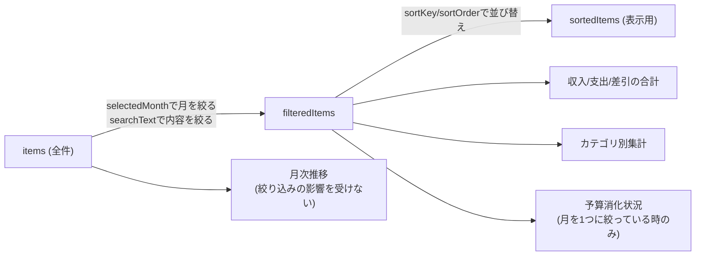

# 設計書: 一覧(/list)

全体像・DB設計・共通仕様は [overview.md](./overview.md) を参照。

## 概要

登録済みの収支を一覧表示し、絞り込み・検索・並び替え・その場編集・削除・各種集計グラフを行う、このアプリで最も機能が多い画面。

関連ファイル:
- フロントエンド: [project/src/app/list/page.tsx](../../project/src/app/list/page.tsx)、[project/src/components/CategoryBarChart.tsx](../../project/src/components/CategoryBarChart.tsx)、[project/src/components/MonthlyTrendChart.tsx](../../project/src/components/MonthlyTrendChart.tsx)、[project/src/components/BudgetProgress.tsx](../../project/src/components/BudgetProgress.tsx)
- バックエンド: [project/src/app/api/search/route.ts](../../project/src/app/api/search/route.ts)、[project/src/app/api/update/route.ts](../../project/src/app/api/update/route.ts)、[project/src/app/api/delete/route.ts](../../project/src/app/api/delete/route.ts)、[project/src/app/api/budget-search/route.ts](../../project/src/app/api/budget-search/route.ts)

## 画面構成(上から順)

| ブロック | 絞り込みの影響 | 内容 |
|---|---|---|
| フィルタバー | — | 月選択・内容検索・並び替えの入力欄 |
| 月次推移グラフ | **受けない**(常に全期間) | 月ごとの収入/支出の折れ線グラフ |
| 収支サマリー | 受ける | 収入・支出・差引の合計 |
| 予算消化状況 | 受ける、かつ月を1つに絞っている時のみ表示 | カテゴリごとの予算メーター |
| カテゴリ別内訳 | 受ける | 支出/収入それぞれの横棒グラフ |
| 明細テーブル | 受ける | 行クリックでその場編集、削除ボタン |

月次推移グラフだけ絞り込みの対象外にしているのは、複数月を横断する推移グラフを1ヶ月に絞ってしまうと意味をなさないため。

## 画面レイアウト

HTMLモック: [mockups/list.html](./mockups/list.html)(ブラウザで直接開いて見た目を確認できる。実際の絞り込み・編集・API通信はしない静的モック。2行目に編集モードの見た目のサンプルを含む)

上から「フィルタバー」→「月次推移グラフ(常に全期間)」→「収支サマリー」→「予算消化状況(月を1つに絞っている時のみ)」→「カテゴリ別内訳(支出/収入の2列)」→「明細テーブル」の順に並ぶ(各ブロックと絞り込みの関係は上表の通り)。行クリック時、その行だけが編集モード(日付/内容/種別/カテゴリ/金額の入力欄+保存/キャンセル/削除ボタン)に切り替わる。

## データ取得

初回マウント時に2つの`useEffect`が並行して動く。

1. `GET /api/search` → `item`全件を取得し、`items` stateにセット。取得後、`selectedMonth`を当月に設定する(サーバー/クライアントの日付ズレでのhydrationエラーを避けるため、初期値は`"all"`にしておき取得後に切り替える)
2. `GET /api/budget-search` → 設定済みの`budget`全件を取得し、`{ category: amount }`の`budgets` stateにセット。失敗しても一覧表示自体はブロックしない(予算進捗が出ないだけにする)

## 絞り込み・検索・並び替え

`useMemo`を使い、`items`から段階的に派生させる。



- `selectedMonth`: `"all"`または`"YYYY-MM"`。`toMonthKey(item.date) === selectedMonth`で絞る
- `searchText`: `item.name`に部分一致するかで絞る
- `sortKey`/`sortOrder`: `date`または`price`を昇順/降順(デフォルトは日付の新しい順)

## 項目定義

### フィルタバー

| No | 項目名 | state キー | 型/属性 | 桁数 | 必須 | 初期値 |
|---|---|---|---|---|---|---|
| 1 | 表示月 | `selectedMonth` | 文字列(`"all"` または `"YYYY-MM"`) | 3文字(`all`)または7文字 | - | 当月(データ取得後に設定) |
| 2 | 内容検索 | `searchText` | 文字列(自由入力) | 上限なし | - | `""` |
| 3 | 並び替え | `sortKey` + `sortOrder` | 文字列(列挙、4パターン) | - | - | `date` / `desc`(日付が新しい順) |

### 明細テーブル列・編集フォーム(`editForm`)

`entry`画面と同一項目(型/桁数/必須/バリデーションは[entry.md](./entry.md)の項目定義を参照)に加え、編集対象の特定に`id`を使う。

| No | 項目名 | state/DBカラム | 型/属性 | 桁数 | 必須 | 備考 |
|---|---|---|---|---|---|---|
| 1 | id | `item.id`(URLやstateには含まない、`editingId`で保持) | 整数(`INTEGER`, PK) | 32bit整数 | ○ | 編集・削除対象の一意特定に使用。ユーザーは編集不可 |
| 2〜6 | 日付/内容/収支種別/カテゴリ/金額 | `editForm.{date,name,type,category,price}` | [entry.md](./entry.md)参照 | 同上 | 同上 | 行クリック時に対象行の値で初期化される |

## その場編集・削除

- 行をクリックすると`editingId`にその行の`id`をセットし、同じ行がテキスト/セレクトの入力欄に切り替わる(`entry`画面と同様のcontrolled input)
- 収支種別を変更すると、`entry`画面と同じくカテゴリの選択肢をリセットする
- 「保存」→`PUT /api/update`、「削除」→`DELETE /api/delete`。成功したらローカルの`items` stateも更新し、再取得はしない(楽観的更新)
- 削除は`window.confirm`で確認を挟む

## 集計ロジック

- **収支サマリー**: `filteredItems`を`type`で振り分けて合計するだけ
- **カテゴリ別内訳**: `filteredItems`を`category`ごとに`Map`で積み上げ、`CategoryBarChart`に渡す(支出用・収入用で別々に集計)
- **月次推移**: `items`(絞り込み前)を`YYYY-MM`ごとに`income`/`expense`で積み上げ、`MonthlyTrendChart`に渡す
- **予算消化状況**: `selectedMonth === "all"`なら計算しない。それ以外は`filteredItems`のうち`type === "支出"`をカテゴリごとに積み上げ、`budgets`(設定済み予算)とカテゴリ名で突き合わせて`{ category, spent, budget }[]`を作り`BudgetProgress`に渡す

## チェック処理仕様

実装: [project/src/lib/validate.ts](../../project/src/lib/validate.ts)。上から順に判定し、最初に該当した1件だけをエラーとして返す。

### `PUT /api/update`(`validateId` → `validateItemFields`)

| No | チェック項目 | 内容 | エラーメッセージ |
|---|---|---|---|
| 1 | id必須・形式 | `id`が存在し、数値に変換できること | `idが不正です` |
| 2 | データ有無 | リクエストボディが存在すること | `データがありません` |
| 3 | 内容必須 | `name`が空文字でなく文字列であること | `nameが不正です` |
| 4 | 金額形式 | `price`が空文字/`null`/`undefined`でなく数値に変換できること(`0`は許容) | `priceが不正です` |
| 5 | 収支種別 | `type`が`ITEM_TYPES`のいずれかであること | `typeが不正です` |
| 6 | カテゴリ整合性 | `category`が選択中`type`に対応する候補に含まれること | `categoryが不正です` |

### `DELETE /api/delete`(`validateId`)

| No | チェック項目 | 内容 | エラーメッセージ |
|---|---|---|---|
| 1 | id必須・形式 | `id`が存在し、数値に変換できること | `idが不正です` |

いずれも、バリデーション通過後にDB上へ該当`id`が実在するかをSQLの実行結果件数で確認する(下記DB更新仕様参照)。存在しない場合は`対象のデータが見つかりません`を返す。

## DB更新仕様

対象テーブル: `item`

### `PUT /api/update` — カラム単位の更新内容

検索条件(WHERE): `id = リクエストのid`

| カラム | 更新するか | 設定値 | 備考 |
|---|---|---|---|
| `id` | しない | — | 更新対象の特定にのみ使用(WHERE条件) |
| `date` | する | リクエストの`date` | そのまま格納 |
| `name` | する | リクエストの`name` | そのまま格納 |
| `price` | する | リクエストの`price` | `Number.parseInt`で整数に変換してから格納 |
| `category` | する | リクエストの`category` | そのまま格納(バリデーション済みの候補値) |
| `type` | する | リクエストの`type` | そのまま格納 |

`id`以外の全カラムを一括更新する(一部項目だけの部分更新はできない)。

| 項目 | 内容 |
|---|---|
| 参考: 実行SQL | `UPDATE item SET date = $1, name = $2, price = $3, category = $4, type = $5 WHERE id = $6 RETURNING id` |
| 0件時の扱い | `RETURNING`の結果が0件(=対象`id`が存在しない)なら`{ success: false, error: "対象のデータが見つかりません" }` |
| 実行環境 | Edge Runtime + `neon()`(本番Neon DBのみ) |

### `DELETE /api/delete` — 削除内容

検索条件(WHERE): `id = リクエストのid`。更新対象カラムはなし(行そのものを削除)。

| 項目 | 内容 |
|---|---|
| 参考: 実行SQL | `DELETE FROM item WHERE id = $1 RETURNING id` |
| 0件時の扱い | `RETURNING`の結果が0件なら`{ success: false, error: "対象のデータが見つかりません" }` |
| 実行環境 | Edge Runtime + `neon()`(本番Neon DBのみ) |

### `GET /api/search` — 取得内容

| カラム | SELECTするか |
|---|---|
| `id`, `date`, `name`, `price`, `category`, `type` | する(全カラム) |

| 項目 | 内容 |
|---|---|
| 参考: 実行SQL | `SELECT id, date, name, price, category, type FROM item ORDER BY id` |
| 絞り込み・並び替え | DB側では行わない。全件取得後、フロントエンド側で`selectedMonth`/`searchText`/`sortKey`により絞り込み・並び替えを行う |

## API仕様

### `GET /api/search`
```json
{ "success": true, "items": [{ "id": 1, "date": "2026-07-01T00:00:00.000Z", "name": "スーパーで買い物", "price": 3200, "category": "食費", "type": "支出" }] }
```

### `PUT /api/update`
リクエスト: `{ "id": 1, "date": "...", "name": "...", "price": "...", "type": "...", "category": "..." }`(バリデーションは`validateId`+`validateItemFields`)。レスポンス: `{ "success": true }`

### `DELETE /api/delete`
リクエスト: `{ "id": 1 }`。レスポンス: `{ "success": true }`。対象idが存在しなければ`{ "success": false, "error": "対象のデータが見つかりません" }`
