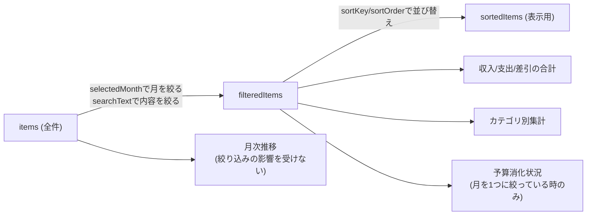

# 設計書: 一覧(/list)

全体像・DB設計・共通仕様は [overview.md](./overview.md) を参照。

## 概要

登録済みの収支を一覧表示し、絞り込み・検索・並び替え・その場編集・削除・各種集計グラフを行う、このアプリで最も機能が多い画面。

関連ファイル: [project/src/app/list/page.tsx](../../project/src/app/list/page.tsx)、[project/src/components/CategoryBarChart.tsx](../../project/src/components/CategoryBarChart.tsx)、[project/src/components/MonthlyTrendChart.tsx](../../project/src/components/MonthlyTrendChart.tsx)、[project/src/components/BudgetProgress.tsx](../../project/src/components/BudgetProgress.tsx)

## 画面構成(上から順)

| ブロック | 絞り込みの影響 | 内容 |
|---|---|---|
| フィルタバー | — | 月選択・内容検索・並び替えの入力欄 |
| 月次推移グラフ | **受けない**(常に全期間) | 月ごとの収入/支出の折れ線グラフ |
| 収支サマリー | 受ける | 収入・支出・差引の合計 |
| 予算消化状況 | 受ける、かつ月を1つに絞っている時のみ表示 | カテゴリごとの予算メーター |
| カテゴリ別内訳 | 受ける | 支出/収入それぞれの横棒グラフ |
| 明細テーブル | 受ける | 行クリックでその場編集、削除ボタン |

月次推移グラフだけ絞り込みの対象外にしているのは、複数月を横断する推移グラフを1ヶ月に絞ってしまうと意味をなさないため。

## データ取得

初回マウント時に2つの`useEffect`が並行して動く。

1. `GET /api/search` → `item`全件を取得し、`items` stateにセット。取得後、`selectedMonth`を当月に設定する(サーバー/クライアントの日付ズレでのhydrationエラーを避けるため、初期値は`"all"`にしておき取得後に切り替える)
2. `GET /api/budget-search` → 設定済みの`budget`全件を取得し、`{ category: amount }`の`budgets` stateにセット。失敗しても一覧表示自体はブロックしない(予算進捗が出ないだけにする)

## 絞り込み・検索・並び替え

`useMemo`を使い、`items`から段階的に派生させる。



- `selectedMonth`: `"all"`または`"YYYY-MM"`。`toMonthKey(item.date) === selectedMonth`で絞る
- `searchText`: `item.name`に部分一致するかで絞る
- `sortKey`/`sortOrder`: `date`または`price`を昇順/降順(デフォルトは日付の新しい順)

## その場編集・削除

- 行をクリックすると`editingId`にその行の`id`をセットし、同じ行がテキスト/セレクトの入力欄に切り替わる(`entry`画面と同様のcontrolled input)
- 収支種別を変更すると、`entry`画面と同じくカテゴリの選択肢をリセットする
- 「保存」→`PUT /api/update`、「削除」→`DELETE /api/delete`。成功したらローカルの`items` stateも更新し、再取得はしない(楽観的更新)
- 削除は`window.confirm`で確認を挟む

## 集計ロジック

- **収支サマリー**: `filteredItems`を`type`で振り分けて合計するだけ
- **カテゴリ別内訳**: `filteredItems`を`category`ごとに`Map`で積み上げ、`CategoryBarChart`に渡す(支出用・収入用で別々に集計)
- **月次推移**: `items`(絞り込み前)を`YYYY-MM`ごとに`income`/`expense`で積み上げ、`MonthlyTrendChart`に渡す
- **予算消化状況**: `selectedMonth === "all"`なら計算しない。それ以外は`filteredItems`のうち`type === "支出"`をカテゴリごとに積み上げ、`budgets`(設定済み予算)とカテゴリ名で突き合わせて`{ category, spent, budget }[]`を作り`BudgetProgress`に渡す

## API仕様

### `GET /api/search`
```json
{ "success": true, "items": [{ "id": 1, "date": "2026-07-01T00:00:00.000Z", "name": "スーパーで買い物", "price": 3200, "category": "食費", "type": "支出" }] }
```

### `PUT /api/update`
リクエスト: `{ "id": 1, "date": "...", "name": "...", "price": "...", "type": "...", "category": "..." }`(バリデーションは`validateId`+`validateItemFields`)。レスポンス: `{ "success": true }`

### `DELETE /api/delete`
リクエスト: `{ "id": 1 }`。レスポンス: `{ "success": true }`。対象idが存在しなければ`{ "success": false, "error": "対象のデータが見つかりません" }`
