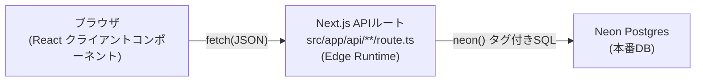

# 設計書: 全体像

各機能の詳細設計は同じフォルダ内の [entry.md](./entry.md)・[list.md](./list.md)・[budget.md](./budget.md) を参照。このファイルには機能をまたいで共通する設計だけをまとめる。

## システム構成

- 画面(`src/app/*/page.tsx`)はすべてクライアントコンポーネント(`"use client"`)。`fetch`でAPIルートを呼ぶ
- APIルートは全て`export const runtime = "edge"`を宣言し、`@neondatabase/serverless`の`neon()`で直接SQLを実行する。Prisma Clientは使わない(理由は[../../CLAUDE.md](../../CLAUDE.md)参照)
- 本番DBとローカル開発用DBは別接続だが、`project/.env`はデフォルトで本番Neon DBを指す(ステージング環境なし)

## データ設計(DB)

### `item`テーブル — 収支の1件のレコード

| カラム | 型 | 説明 |
|---|---|---|
| `id` | Int (PK, autoincrement) | 自動採番 |
| `date` | DateTime | 取引日 |
| `name` | String | 内容(品目・メモ) |
| `price` | Int | 金額(円、0以上) |
| `category` | String | カテゴリ。既定値`"その他"` |
| `type` | String | `"支出"` または `"収入"`。既定値`"支出"` |

### `budget`テーブル — カテゴリごとの継続的な月間予算

| カラム | 型 | 説明 |
|---|---|---|
| `category` | String (PK) | 支出カテゴリ名(`CATEGORIES_BY_TYPE.支出`のいずれか) |
| `amount` | Int | 月間予算額(円、0以上) |

行が存在しないカテゴリは「予算未設定」を意味する(NULLではなく行の有無で表現する)。月ごとの個別予算は持たない(継続的に同じ金額が毎月適用される)。

スキーマの定義自体は[../../project/prisma/schema.prisma](../../project/prisma/schema.prisma)、マイグレーション履歴は[../../project/prisma/migrations/](../../project/prisma/migrations/)を参照。

## 共通ロジック

- **[../../project/src/lib/categories.ts](../../project/src/lib/categories.ts)** — `ITEM_TYPES`(収支種別)・`CATEGORIES_BY_TYPE`(種別ごとのカテゴリ候補)を定義。フロントエンドの選択肢とAPIのバリデーションの両方がここを参照し、許容値がずれないようにしている
- **[../../project/src/lib/validate.ts](../../project/src/lib/validate.ts)** — `validateItemFields`(name/price/type/category)・`validateId`・`validateBudget`(category/amount)。いずれも「問題があればエラー文字列、なければ`null`」という同じ形式

## 共通API仕様

すべてのAPIルートは`{ success: boolean, ... }`形式のJSONを返す。

- 成功時: `{ success: true, ... }`(取得系は追加でデータを含む)
- 失敗時: `{ success: false, error: string }`。**HTTPステータスは常に200**(エラーコードでは表現しない)

| エンドポイント | メソッド | 用途 | 詳細 |
|---|---|---|---|
| `/api/search` | GET | item全件取得 | [entry.md](./entry.md) / [list.md](./list.md) |
| `/api/insert` | POST | item新規作成 | [entry.md](./entry.md) |
| `/api/update` | PUT | item更新 | [list.md](./list.md) |
| `/api/delete` | DELETE | item削除 | [list.md](./list.md) |
| `/api/budget-search` | GET | budget全件取得 | [budget.md](./budget.md) |
| `/api/budget-upsert` | PUT | budget作成/更新 | [budget.md](./budget.md) |
| `/api/budget-delete` | DELETE | budget削除(未設定に戻す) | [budget.md](./budget.md) |

## 画面一覧

| パス | 画面 | 設計書 |
|---|---|---|
| `/` | トップページ(各画面へのリンク) | — |
| `/entry` | 収支入力 | [entry.md](./entry.md) |
| `/list` | 一覧・絞り込み・検索・並び替え・集計・予算進捗 | [list.md](./list.md) |
| `/budget` | 予算設定 | [budget.md](./budget.md) |
